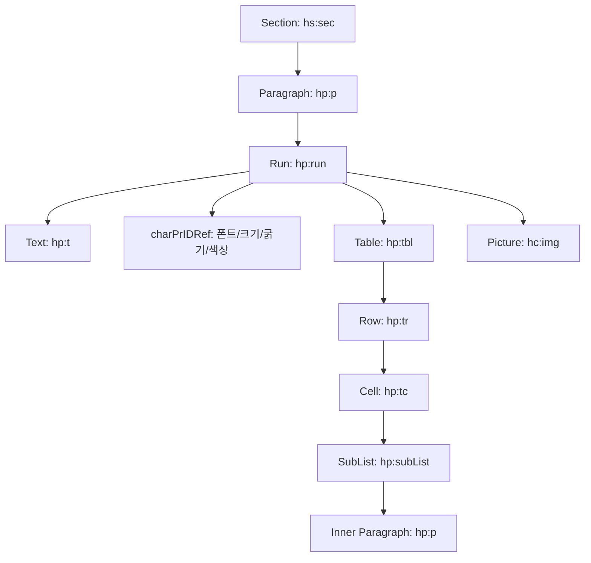

# HWPX (OWPML) 문서 규격 개요

HWPX는 KS X 6101 표준(개방형 워드프로세서 마크업 언어, OWPML)을 따르는 한글 문서 규격입니다.
물리적으로는 표준 ZIP 압축 컨테이너이며, 내부에 XML 파일과 미디어 리소스(이미지 등)가 패키징되어 있습니다.

---

## 1. 패키지 디렉토리 구조

```text
document.hwpx (ZIP 컨테이너)
├── mimetype                             # 반드시 첫 번째 엔트리, 무압축 STORE ("application/owpml")
├── version.xml                          # HCF/OWPML 애플리케이션 버전 정보
├── settings.xml                         # 문서 뷰어 캐럿 위치 및 기본 뷰 설정
├── META-INF/
│   ├── container.xml                    # 루트 파일 (Contents/content.hpf) 위치 정의
│   └── manifest.xml                     # 패키지 내부 전체 파일 목록 및 MIME 타입 매니페스트
├── Contents/
│   ├── content.hpf                      # OPF 패키지 메타데이터(제목, 작성자 등) 및 spine(섹션 순서)
│   ├── header.xml                       # 폰트(fontfaces), 글자모양(charPr), 문단모양(paraPr), 테두리(borderFills) 정의
│   ├── section0.xml                     # 실제 본문 문단(hp:p), 런(hp:run), 표(hp:tbl) 등
│   └── section1.xml                     # 다중 섹션인 경우 순차적 정의
├── BinData/
│   ├── image1.png                       # 본문에 삽입된 이미지 및 첨부 리소스
│   └── image2.jpg
└── Preview/
    └── PrvText.txt                      # 텍스트 미리보기용 일반 텍스트 파일
```

---

## 2. 주요 OWPML 네임스페이스

- `hh` : `http://www.hancom.co.kr/hwpml/2011/head` (문서 헤더, 폰트 및 서식 정의)
- `hp` : `http://www.hancom.co.kr/hwpml/2011/paragraph` (문단, 런, 텍스트, 표)
- `hs` : `http://www.hancom.co.kr/hwpml/2011/section` (섹션 컨테이너)
- `hc` : `http://www.hancom.co.kr/hwpml/2011/core` (코어 공통 속성, 좌표 등)
- `opf`: `http://www.idpf.org/2007/opf/` (EPUB 호환 패키지 메타데이터)

---

## 3. 본문 렌더링 계층 구조



`jhwpx.js`는 이 계층 구조를 순회하여 브라우저 DOM 및 고해상도 인쇄 가능한 HTML/CSS로 변환합니다.
